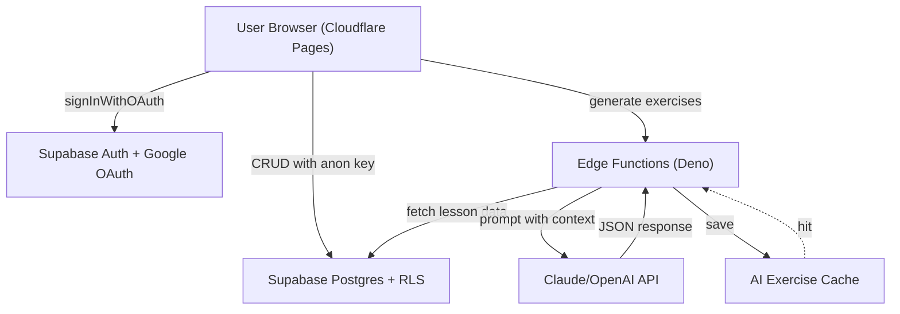
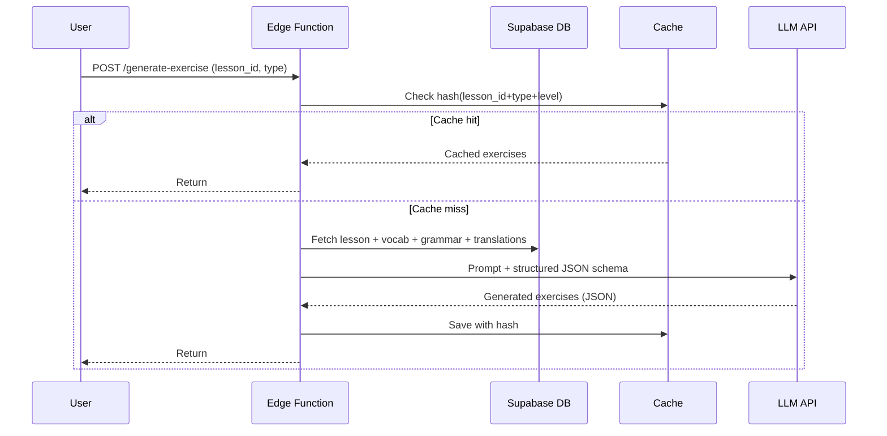

# Kien truc he thong

## 1. Kien truc tong the

### Luu y bao mat

- **Anon key** Supabase duoc phep lo tren client vi RLS bao ve.
- **Service role key** tuyet doi khong nhung frontend — chi dung trong Edge Functions.

## 2. AI Agent — Generate Exercises tu UGC

### 2.1. Kien truc 3 tang

### 2.2. Cac loai bai AI sinh duoc

| Loai bai | Mo ta |
|----------|-------|
| **Ghep cau** | Tu vung da hoc trong lesson + grammar pattern → tao cau hoan chinh |
| **Fill-in-the-blank** | Dung grammar pattern + vocab cung lesson, de trong vi tri key |
| **Dich nguoc** | Tu `translation_exercises` user nhap, dao Trung→Viet |
| **Multiple choice** | Voi distractor la tu HSK cung level (tranh qua de) |
| **Sua loi sai** | AI chen loi co y vao cau dung, user phai tim va sua |
| **Sap xep cau** | Xao tron cac tu trong cau, user keo tha lai dung thu tu |

### 2.3. Quan ly chi phi LLM

> Khong cache + khong rate limit → quota LLM chay trong vai ngay khi co user that. Bat buoc lam tu ngay dau.

- **Cache** theo `hash(lesson_id + exercise_type + user_level)` — bai giong nhau dung chung
- **Rate limit**: 10 generation/user/ngay o free tier, 100/ngay o paid
- **Pre-generate batch**: Cron Edge Function chay ban dem, sinh san cho lesson hot
- **Prompt ngan gon**: chi truyen vocab/grammar can thiet, khong truyen toan bo lesson
- **Output structured JSON**: dung tool calling/JSON mode de tranh parsing fail va retry

## 3. Toi uu tan suat Flashcard (SRS)

Cong thuc weighted score quyet dinh tu nao hien thi tiep theo — dung SQL view, **khong can ML**:

| Yeu to | Trong so | Y nghia |
|--------|----------|---------|
| SRS due date | **40%** | Da den lich review theo thuat toan SM-2 |
| Mastery level | **25%** | Cang yeu cang uu tien hien thi |
| Lesson frequency | **20%** | Tu xuat hien nhieu trong lesson user da import |
| Recency in user lessons | **10%** | Tu trong lesson user vua them gan day |
| Co-occurrence | **5%** | Cung xuat hien voi tu user dang hoc |

**Implementation**: SQL view `user_word_priority` hoac materialized view refresh moi gio qua `pg_cron`.
