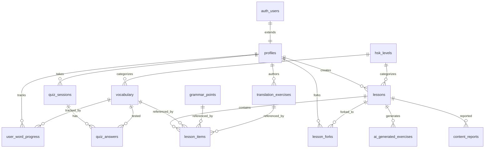

# Database Schema

## 1. So do ERD tong the

## 2. Bang dung chung (public read)

### hsk_levels

| Cot | Mo ta |
|-----|-------|
| id (1-6) | Ma cap do |
| name | Ten cap do |
| description | Mo ta |

### vocabulary

| Cot | Mo ta |
|-----|-------|
| id | Primary key |
| hanzi | Chu Han |
| pinyin | Phien am |
| meaning_vi | Nghia tieng Viet |
| hsk_level | Cap do HSK (FK → hsk_levels) |
| audio_url | URL file am thanh |
| created_by | User tao (NULL = official) |
| source_lesson_id | Lesson nguon |
| usage_count | So lan su dung |

### grammar_points

| Cot | Mo ta |
|-----|-------|
| id | Primary key |
| pattern | Mau cau truc |
| explanation_vi | Giai thich tieng Viet |
| examples | Vi du (jsonb) |
| hsk_level | Cap do HSK |
| created_by | User tao |

## 3. Bang UGC — content do user tao

### lessons

| Cot | Mo ta |
|-----|-------|
| id | Primary key |
| title | Tieu de bai hoc |
| hsk_level | Cap do HSK |
| creator_id | User tao (NULL = official) |
| visibility | private / unlisted / public |
| source_type | curated / community / ai_generated |
| upvotes | So luot vote len |
| downvotes | So luot vote xuong |

### lesson_items

| Cot | Mo ta |
|-----|-------|
| id | Primary key |
| lesson_id | FK → lessons |
| item_type | vocab / grammar / translation |
| item_id | Polymorphic FK |
| order_index | Thu tu trong bai |

> 1 lesson chua mix vocab + grammar + bai dich theo thu tu.

### translation_exercises

| Cot | Mo ta |
|-----|-------|
| id | Primary key |
| source_text_vi | Cau tieng Viet |
| target_text_zh | Cau tieng Trung |
| difficulty | Do kho |
| hsk_level | Cap do HSK |
| created_by | User tao |
| lesson_id | FK → lessons |

### lesson_forks

| Cot | Mo ta |
|-----|-------|
| id | Primary key |
| original_lesson_id | Lesson goc |
| forked_lesson_id | Lesson ban sao |
| user_id | User fork |
| forked_at | Thoi gian fork |

### content_reports

| Cot | Mo ta |
|-----|-------|
| id | Primary key |
| target_type | Loai noi dung bi report |
| target_id | ID noi dung |
| reporter_id | User report |
| reason | Ly do |
| status | Trang thai xu ly |

### ai_generated_exercises

| Cot | Mo ta |
|-----|-------|
| id | Primary key |
| lesson_id | FK → lessons |
| exercise_type | Loai bai tap |
| content | Noi dung (jsonb) |
| prompt_hash | Hash de cache |
| generated_at | Thoi gian sinh |
| generated_for_user_id | Sinh cho user nao |

## 4. Bang per-user (RLS theo `auth.uid()`)

### profiles

| Cot | Mo ta |
|-----|-------|
| id | = auth.users.id |
| display_name | Ten hien thi |
| avatar_url | URL avatar |
| current_hsk_level | Cap do hien tai |
| enabled_features | Feature flags (text[]) |

### user_word_progress

| Cot | Mo ta |
|-----|-------|
| user_id | FK → profiles |
| vocabulary_id | FK → vocabulary |
| mastery_level | Muc do thong thao |
| last_seen_at | Lan cuoi xem |
| next_review_at | Lan review tiep theo |
| ease_factor | He so de (SM-2) |
| interval_days | Khoang cach ngay (SM-2) |
| times_correct | So lan dung |
| times_wrong | So lan sai |

### quiz_sessions

| Cot | Mo ta |
|-----|-------|
| id | Primary key |
| user_id | FK → profiles |
| lesson_id | FK → lessons |
| score | Diem |
| total_questions | Tong so cau hoi |
| completed_at | Thoi gian hoan thanh |

### quiz_answers

| Cot | Mo ta |
|-----|-------|
| session_id | FK → quiz_sessions |
| vocabulary_id | FK → vocabulary |
| is_correct | Dung/sai |
| time_spent_ms | Thoi gian tra loi (ms) |

## 5. RLS Policies

> Neu **quen bat RLS**, moi user se thay data cua nhau. Kiem tra ngay sau moi `CREATE TABLE` bang cau lenh `ALTER TABLE ... ENABLE ROW LEVEL SECURITY`.

- **Bang public** (`vocabulary`, `lessons` voi visibility='public', `hsk_levels`): policy `SELECT` cho `authenticated` role
- **Bang user**: `USING (auth.uid() = user_id)` cho ca SELECT/INSERT/UPDATE/DELETE
- **`profiles`**: `USING (auth.uid() = id)`
- **Trigger** `on_auth_user_created`: tu tao row `profiles` khi user dang ky lan dau
- **`lessons` UGC**: cho phep SELECT neu `visibility = 'public'` HOAC `creator_id = auth.uid()`
