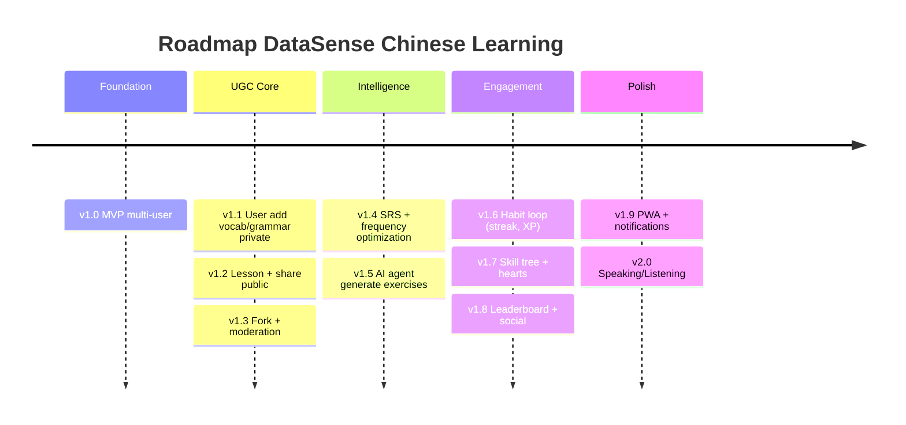

# Roadmap

## 1. Lo trinh tong quan

## 2. Chi tiet tung version

### v1.0 — MVP Multi-user

- Migrate flashcard/quiz/HSK tu project hien tai len Supabase
- Google OAuth login
- 8 bang co ban: `profiles`, `vocabulary`, `hsk_levels`, `lessons`, `lesson_items`, `user_word_progress`, `quiz_sessions`, `quiz_answers`
- Content official do admin seed san
- Deploy len Cloudflare Pages

### v1.1 — UGC co ban

- User them vocab/grammar **private** vao du lieu ca nhan
- UI form nhap tu + ngu phap
- Bo sung cot `created_by`, `visibility` vao `vocabulary`, them bang `grammar_points`

### v1.2 — Lesson hoa & Share

- Gom vocab/grammar/translation thanh **lesson** co thu tu
- Bang `translation_exercises` cho bai dich
- Toggle visibility: private → unlisted (link) → public
- Browse lesson public theo HSK level

### v1.3 — Fork & Moderation

- Fork lesson nguoi khac ve chinh sua rieng (bang `lesson_forks`)
- Upvote/downvote lesson
- Report noi dung sai (bang `content_reports`)
- Admin dashboard duyet report

### v1.4 — SRS + Toi uu tan suat

- Implement thuat toan SM-2 (ease_factor, interval_days)
- View `user_word_priority` voi 5 yeu to weighted
- Tu hoc sai xuat hien lai som hon
- Stats dashboard cho user

### v1.5 — AI Agent

- Edge Function `generate-exercise`
- Bang `ai_generated_exercises` + cache layer
- 6 loai bai: ghep cau, fill-blank, dich nguoc, MCQ, sua loi, sap xep
- Rate limit + quota tracking

### v1.6 — Habit Loop

- Streak ngay, XP, daily goal
- Achievements co ban
- Bang moi: `daily_activity`, `achievements`, `user_achievements`

### v1.7 — Skill Tree + Hearts

- Skill tree mo khoa tuan tu (giong Duolingo)
- 5 hearts, hoi sau 4h, practice mode hoi mien phi
- Crown level moi skill

### v1.8 — Leaderboard + Social

- BXH tuan, league promote/demote
- Friend system + activity feed
- Can Edge Function cron weekly reset

### v1.9 — PWA + Notifications

- Cai nhu app tren home screen
- Web push reminder streak
- Offline mode cho flashcard

### v2.0 — Speaking/Listening

- Web Speech API: TTS phat am chuan
- SpeechRecognition: cham diem phat am user
- Bang `pronunciation_attempts` (optional)

## 3. Moc kien truc can chu y

- **Sau v1.5** — bat dau can Edge Functions. Supabase Edge Functions free tier 500K invocations/thang, du dung.
- **Sau v1.7** — can nhac PWA hoa khi user da co habit hang ngay. Chi them `manifest.json` + service worker, khong phai viet lai code.
- **Sau v2.0** — option mobile native qua Capacitor wrap toan bo web hien co thanh iOS/Android, khong can React Native.

## 4. Rui ro & Mitigation

| Rui ro | Muc do | Mitigation |
|--------|--------|------------|
| Quen bat RLS → lo data user | **Cao** | Checklist sau moi CREATE TABLE, test bang anon key |
| LLM cost chay quota | **Cao** | Cache + rate limit tu ngay dau, monitor daily spend |
| UGC chat luong kem (spam, sai chinh ta) | Trung binh | Voting + moderation queue + auto-flag bang AI |
| Ban quyen giao trinh | Trung binh | ToS ro rang, takedown process, khong cho copy nguyen trang |
| Service role key lo frontend | **Cao** | Chi dung trong Edge Functions, khong bao gio trong client |
| `lesson_items` polymorphic cham khi scale | Thap | Index rieng theo (lesson_id, item_type), tach bang neu can |

## 5. Buoc tiep theo

- [ ] Setup Supabase project + Google OAuth credentials
- [ ] Viet file SQL DDL `001_init.sql` cho 8 bang v1.0
- [ ] Setup repo Cloudflare Pages connect Git
- [ ] Implement Google sign-in flow dau tien
- [ ] Migrate vocab data hien tai len bang `vocabulary`
- [ ] Test RLS bang 2 user khac nhau

## 6. Quy tac giu project cai tien duoc

- Moi version 1 nhanh git rieng, merge khi xong
- Schema migration luu thanh file SQL co version (`001_init.sql`, `002_streak.sql`...) trong repo
- Feature flag bang cot `enabled_features` (text[]) trong `profiles` → bat/tat feature moi cho user test
- v1.0-v1.3 van vanilla JS duoc
- Tu v1.4 tro di nen can nhac framework nhe (Alpine.js hoac Preact) vi state phuc tap hon
- Schema **chi them** bang/cot moi, **khong sua** cu → backward compatible
